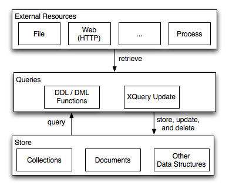
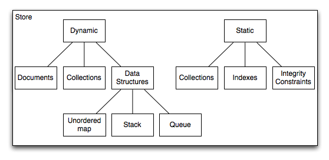

# Data Lifecycle

## Overview

This sections gives a short overview of the Zorba data lifecycle: how to load data in the Zorba store, how to query and update it, and how to remove the data from the store.



The store contains several types of data containers: documents, collections, and other structures.
Each such container is identified by a name, which can be a URI or a QName.
The association between the name and the content of the containers is maintained by the store during the lifetime of the container.

There are two kinds of containers: static and dynamic.
Collections can be either static or dynamic.
Documents, maps, stacks, and queues can only be dynamic. 



While the dynamic containers require no static knowledge from the query processor (no need for explicit knowledge about their existence at compilation time), the static collections require the query processor to be aware of their existence, and take this information into consideration at compilation and optimization time.
Note that static collections can have indexes and integrity constraints defined on them (declared using the \ref xqddf), while the dynamic structures cannot.
At compilation time the query processor needs to be aware of the indexes, integrity constraints of the static collections in order to generate correct  and optimal execution plans.

Both static and dynamic collections have functions that allow queries to manipulate them.
Like in most other databases, the functions are clustered into Data Definition Modules (DDL; e.g. creation, deletion) and Data Manipulation Modules (DML; e.g. query, update).


The following tables gives the complete list of all Zorba modules that allow the manipulation of static and dynamic containers.

<table>
  <tr>
    <td colspan="3">
    <b>Static Containers</b>
    </td>
  </tr>
  <tr>
    <td><b>Container Type</b></td>
    <td><b>Definition (DDL) / Manipulation (DML)</b></td>
    <td><b>Module Namespace</b></td>
  </tr>
  <tr>
    <td>Collections</td>
    <td>DDL</td>
    <td><a href="/modules/latest/zorba.io/modules/store/static/collections/ddl">http://zorba.io/modules/store/static/collections/ddl</a></td>
  </tr>
  <tr>
    <td>Collections</td>
    <td>DML</td>
    <td><a href="/modules/latest/zorba.io/modules/store/static/collections/dml">http://zorba.io/modules/store/static/collections/dml</a></td>
  </tr>
  <tr>
    <td>Indexes</td>
    <td>DDL</td>
    <td><a href="/modules/latest/zorba.io/modules/store/static/indexes/ddl">http://zorba.io/modules/store/static/indexes/ddl</a></td>
  </tr>
  <tr>
    <td>Indexes</td>
    <td>DML</td>
    <td><a href="/modules/latest/zorba.io/modules/store/static/indexes/dml">http://zorba.io/modules/store/static/indexes/dml</a></td>
  </tr>
  <tr>
    <td>Integrity Constraints</td>
    <td>DDL</td>
    <td><a href="/modules/latest/zorba.io/modules/store/static/integrity/constraints/ddl">http://zorba.io/modules/store/static/integrity_constraints/ddl</a></td>
  </tr>
  <tr>
    <td>Integrity Constraints</td>
    <td>DML</td>
    <td><a href="/modules/zorba.io/modules/store/static/integrity/constraints/dml">http://zorba.io/modules/store/static/integrity_constraints/dml</a></td>
  </tr>
</table>


<table>
  <tr>
    <td colspan="3">
    <b>Dynamic Containers</b>
    </td>
  </tr>
  <tr>
    <td><b>Container Type</b></td>
    <td><b>Definition (DDL) / Manipulation (DML)</b></td>
    <td><b>Module Namespace</b></td>
  </tr>
  <tr>
    <td>Collections</td>
    <td>DDL</td>
    <td><a href="/modules/latest/zorba.io/modules/store/dynamic/collections/ddl">http://zorba.io/modules/store/dynamic/collections/ddl</a></td>
  </tr>
  <tr>
    <td>Collections</td>
    <td>DML</td>
    <td><a href="/modules/latest/zorba.io/modules/store/dynamic/collections/dml">http://zorba.io/modules/store/dynamic/collections/dml</a></td>
  </tr>
  <tr>
    <td>W3C Collections</td>
    <td>DDL</td>
    <td><a href="/modules/latest/zorba.io/modules/store/dynamic/collections/w3c/ddl">http://zorba.io/modules/store/dynamic/collections/w3c/ddl</a></td>
  </tr>
  <tr>
    <td>W3C Collections</td>
    <td>DML</td>
    <td><a href="/modules/latest/zorba.io/modules/store/dynamic/collections/w3c/dml">http://zorba.io/modules/store/dynamic/collections/w3c/dml</a></td>
  </tr>
  <tr>
    <td>Documents</td>
    <td>DDL / DML</td>
    <td><a href="/modules/latest/zorba.io/modules/store/dynamic/documents">http://zorba.io/modules/store/documents</a></td>
  </tr>
  <tr>
    <td>Unordered Maps</td>
    <td>DDL / DML</td>
    <td><a href="/modules/latest/zorba.io/modules/unordered-maps">http://zorba.io/modules/unordered-maps</a></td>
  </tr>
  <tr>
    <td>Stacks</td>
    <td>DDL / DML</td>
    <td><a href="/modules/latest/zorba.io/modules/stack">http://zorba.io/modules/stack</a></td>
  </tr>
  <tr>
    <td>Queues</td>
    <td>DDL / DML</td>
    <td><a href="/modules/latest/zorba.io/modules/queue">http://zorba.io/modules/queue</a></td>
  </tr>
</table>

Please note that all of the modules listed above require JSONiq or at least XQuery version 3.0.

Other the fact the static and dynamic containers are treated differently by the query processor during compilation, their lifetime is exactly the same.
Data can be loaded in any container -- static or dynamic --  and after that it will be available for queries and updates, until the data is explicitly deleted from the store, or the store itself expires.
(Note that not all the Zorba Stores are persistent stores).
Please refer to the section below on various Zorba stores.

Also please note that a data container that is available in the store will be available to all programs that are being executed synchronously.
Again, please read more about the Zorba Data Stores below about data consistency details.

## Examples
In the following, we show a couple of examples to demonstrate how data can be retrieved and store in various kinds of containers.
It is important to note that most of the examples uses the [Scripting Extension](../scripting_tutorial.md) for apply pending updates in order to make them visible to subsequent expressions in the same program.

### Scenario 1

In the first scenario, we show how to use the XQDDF and the XQuery Update Facility to
* declare and create a collection with an,
* add data to the collection that is retrieved from the web,
* query the collection,
* delete and modify data in the collection, and
* finally delete the entire collection an the index

### Declare a Collection with Index
Declare an unordered collection that can store KML placemarks (see <a href="http://code.google.com/apis/kml/documentation/">http://code.google.com/apis/kml/documentation/</a>).
On top of this collection, we declare a unique value index that is indexing the names of the parks.
Please note that this module is a library module because collections and indexes can not be declared in a main module.
All of the following examples import the library module in order to be able to access the collection.

```xquery
module namespace kml-data = "http://www.mykml/data";

import module namespace cdml = "http://zorba.io/modules/store/static/collections/dml";

import schema namespace kml = "http://earth.google.com/kml/2.1" at "kml21.xsd";

declare namespace ann = "http://zorba.io/annotations";

declare %ann:unordered collection kml-data:placemarks
  as schema-element(kml:Placemark)*;

declare %ann:automatic %ann:value-equality %ann:unique index kml-data:park-names
  on nodes cdml:collection(xs:QName("kml-data:placemarks"))
  by ./kml:name as xs:string;
```

### Create a Collection and Index
This is an administration program that imports the module declaring the collection and invokes the <tt>create</tt> and <tt>create</tt> functions to create the empty collection and index containers, respectively.

```xquery
import module namespace cddl = "http://zorba.io/modules/store/static/collections/ddl";
import module namespace iddl = "http://zorba.io/modules/store/static/indexes/ddl";

import module namespace kml-data = "http://www.mykml/data" at "sc1_ex1.xqlib";

cddl:create(xs:QName("kml-data:placemarks"));
iddl:create(xs:QName("kml-data:park-names"));

(: sanity check: return true if collection is available, false otherwise :)
cddl:is-available-collection(xs:QName("kml-data:placemarks"))
```

### Store Data in a Collection
Once the collection has been created, we can now populate it with some placemarks.
The according placemarks (data about Wildlife National Parks in India) is retrieved from the web.
The resource retrieved is a single KML document, from which we select only the placemarks.
Before inserting them into the collection, the validate expression makes sure that each placemark is valid according to the KML schema.

```xquery
import module namespace cdml = "http://zorba.io/modules/store/static/collections/dml";

import module namespace http = "http://www.zorba-xquery.com/modules/http-client";

import schema namespace kml = "http://earth.google.com/kml/2.1" at "kml21.xsd";

import module namespace kml-data = "http://www.mykml/data" at "sc1_ex1.xqlib";

let $doc := http:get-text("http://zorbatest.28.io:8080/http-test-data/wildlife-national-parks-india.kml")[2]
for $placemark in fn:parse-xml($doc)//kml:Placemark
return 
  cdml:insert(xs:QName("kml-data:placemarks"),
    validate { $placemark }
  );
```

### Query a Collection's Data
This very simple query shows how to invoke the collection function of the dml module to retrieve the contents of the collection.
The query returns the names of all national parks in India that have elephants.

```xquery
import module namespace cdml = "http://zorba.io/modules/store/static/collections/dml";

import schema namespace kml = "http://earth.google.com/kml/2.1" at "kml21.xsd";

import module namespace kml-data = "http://www.mykml/data" at "sc1_ex1.xqlib";

for $placemark in cdml:collection(xs:QName("kml-data:placemarks"))
where $placemark/kml:description contains text "Elephants"
return 
  $placemark/kml:name/text()
```

### Delete Nodes from a Collection
To do cleanup of the data in the collection, the following snippet deletes all national parks from the database that do not have Elephants.

```xquery
import module namespace cdml = "http://zorba.io/modules/store/static/collections/dml";

import schema namespace kml = "http://earth.google.com/kml/2.1" at "kml21.xsd";

import module namespace kml-data = "http://www.mykml/data" at "sc1_ex1.xqlib";

cdml:delete(
  for $placemark in cdml:collection(xs:QName("kml-data:placemarks"))
  where not(contains($placemark/kml:description, "Elephants"))
  return $placemark
)
```

### Updates Nodes in a Collection
In order modify a particular node in a collection, the XQuery Update Facility can be used.
In the example below, we set the visibility of all national parks that contain wild pigs to false because we don't want them to show up in a map.
Please note that we need to insert the *visibility* element after the name element because otherwise the revalidation of the node in the collection would fail.

```xquery
import module namespace cdml = "http://zorba.io/modules/store/static/collections/dml";

import schema namespace kml = "http://earth.google.com/kml/2.1" at "kml21.xsd";

import module namespace kml-data = "http://www.mykml/data" at "sc1_ex1.xqlib";

for $placemark in cdml:collection(xs:QName("kml-data:placemarks"))
where contains($placemark/kml:description, "Wild Pigs")
return 
  insert node
    <kml:visibility>false</kml:visibility>
  after
    $placemark/kml:name;
```

### Delete a Collection

Finally, the last examples shows how the collection and index containers can be deleted from the store.
All the nodes stored in the collection are also deleted.
Please note that the index has to be deleted before the according collection.

```xquery
import module namespace cddl = "http://zorba.io/modules/store/static/collections/ddl";
import module namespace iddl = "http://zorba.io/modules/store/static/indexes/ddl";

import module namespace kml-data = "http://www.mykml/data" at "sc1_ex1.xqlib";

iddl:delete(xs:QName("kml-data:park-names"));
cddl:delete(xs:QName("kml-data:placemarks"));
cddl:is-available-collection(xs:QName("kml-data:placemarks"))
```

### Scenario 2

The examples in this subsection show how to
* create a dynamic collection,
* retrieve data form the web and load in a collection,
* query and update data, and
* delete the collection.

### Creating a Dynamic Collection

Analogous to the creation of a collection in \ref dl_sc1_ex2, the following examples demonstrates how a dynamic collection can be created.
The collection is called "earthquakes" and will be used to contain data of the worldwide earthquakes from July, 29th 2011 to August, 5th 2011 (retrieved from <a href="http://explore.data.gov/Geography-and-Environment/Worldwide-M1-Earthquakes-Past-7-Days/7tag-iwnu">data.gov</a>).

```xquery
import module namespace cddl = "http://zorba.io/modules/store/dynamic/collections/ddl";

declare variable $coll-name := xs:QName("earthquakes");

cddl:create($coll-name);
cddl:is-available-collection($coll-name)
```

### Retrieve Data and Store in Collection

This examples fetches the data as CSV from the web, converts it to XML, and inserts it into the earthquake collection.
The conversion is done using <a href="/modules/latest/www.zorba-xquery.com/modules/converters/csv">Zorba's CSV converter module</a>.

```xquery
import module namespace cdml = "http://zorba.io/modules/store/dynamic/collections/dml";

import module namespace http = "http://www.zorba-xquery.com/modules/http-client";

import module namespace csv = "http://www.zorba-xquery.com/modules/converters/csv";

let $data := http:get-text("http://zorbatest.28.io:8080/http-test-data/eqs7day-M1.txt")[2]
for $entry in csv:parse($data, ())[position() > 1] (: skip csv header row :)
return
  cdml:insert-last(xs:QName("earthquakes"), $entry );
```

### Query a Collection

Given all the information of earthquakes in the collection, the following example shows how to query that data.
The query selects all the earthquakes having a magnitude of three or higher whose region contains the string "California".

```xquery
import module namespace cdml = "http://zorba.io/modules/store/dynamic/collections/dml";

for $e in cdml:collection(xs:QName("earthquakes"))
let $r := $e/column[last()] (: last column contains region name :)
where xs:double($e/column[7]) > 3 (: 7th column contains magnitude :)
group by $r2 := $r
let $r := $r[1]
where $r contains text ("California")
return
  <region name="{$r}">{ $e }</region>
```

## Scenario 3

Previous examples have show how to work with static and dynamic collections.
The next set of examples will focus on documents.
As a data set, we use the meat, poultry, and egg inspection directory from <a href="http://explore.data.gov/Agriculture/Meat-Poultry-and-Egg-Inspection-Directory-by-Estab/ffj8-dww2">data.gov</a>.
The data is available as a CSV file in our file system.

### Put a Document
In this example, we read a file from the file system whose name is available in the external variable named input-context.
The CSV contents of the file is parsed and converted into XML using the <a href="/modules/latest/www.zorba-xquery.com/modules/converters/csv">CSV module</a>.
The resulting document is put into the store and given the name "meat_poultry.xml".

```xquery
import module namespace f = "http://expath.org/ns/file";
import module namespace c = "http://www.zorba-xquery.com/modules/converters/csv";

import module namespace doc = "http://zorba.io/modules/store/documents";

declare variable $input-context external;

let $doc := document { <root> { c:parse(f:read-text($input-context), ()) } </root> }
return doc:put("meat_poultry.xml", $doc);
```

### Retrieving and Modifying a Document
The XML format of the resulting document (from the CSV conversion in the previous example) is not really nice.
For example, a sketch of the document is as follows:

```xml
<root>
  <row>
    <column>EstNumber</column>
    <column>Company</column>
    <column>Street</column>
    <column>City</column>
    <column>State</column>
    <column>Zip</column>
    <column>Phone</column>
    <column>GrantDate</column>
    <column>Activities</column>
    <column>DBAs</column>
  </row>
  <row>
    <column>M1-P1370</column>
    <column>Vienna Beef Ltd.</column>
    <column>2501 N. Damen Ave.</column>
    <column>Chicago</column>
    <column>IL</column>
    <column>60647</column>
    <column>(773) 278-7800</column>
    <column/>
    <column>Processing</column>
    <column>Bistro Soups,David Berg,International Deli Brokerage,Kosher Zion Sausage Co,Vienna Beef LTD,Vienna Sausage Manufacturing</column>
  </row>
</root>
```

The columns in the first row element define the names of the columns in the subsequent row elements.
The following query uses an XQuery Update expression to rename the columns.

```xquery
import module namespace doc = "http://zorba.io/modules/store/documents";

let $doc := doc:document("meat_poultry.xml")
let $first-row := $doc/root/row[1]
for $row in $doc/root/row[position() > 1]
for $column at $y in $row/column
return rename node $column as $first-row/column[$y]
```

Please note that the <tt>first-row-is-header</tt> option of the <tt>csv:parse</tt> function would have done the job also but we though it was more fun to present this query. ;-)

### Serializing a Document to JSON

In this last example, we show how the document resulting from the previous example can be serialized to JSON using <a href="/modules/latest/www.zorba-xquery.com/modules/converters/json">Zorba's JSON module</a>.

```xquery
import module namespace doc = "http://zorba.io/modules/store/documents";

import module namespace j = "http://zorba.io/modules/json-xml";

j:xml-to-json(
  doc:document("meat_poultry.xml")/root/row,
  { "json-format" : "JsonML-array" }
)
```

Note: data can be loaded in the Zorba store either via API calls (see the C++ API and the other APIs, link) or directly via function calls.
Both ways are being executed internally in exactly the same way -- in fact all such C++ API functions are 100% mirrored by functions.
We strongly encourage users to use the modules for data manipulation instead of the C++ API.
The reason is simple: the processor can understand the data flow and data lifecycle in the first case, while it cannot in the second.

##  Zorba Stores

Zorba defines a Store API that allows developers to seamlessly process data stored in different places.
Essentially, the Store API is a C++ interface for
* <a href="http://www.w3.org/TR/xpath-datamodel/">XQuery and XPath Data Model (XDM)</a>,
* <a href="http://jsoniq.org/docs/JSONiq/html-single/index.html#chapter-data-model">JSONiq Data Model (JDM)</a>,
* PULs defined by the <a href="http://www.w3.org/TR/xquery-update-10/">XQuery Update Facility</a>,
* PULs defined by the \ref xqddf, and
* an XDM extension for <a href="http://www.w3.org/TR/xpath-full-text-10/">XQuery Full Text</a>.

Implementing this API allows, for example, processing of data stored in main memory, on mobile devices, in browsers, or disk- and cloud-based environments.

It is important to understand that each store implementation may define its own semantics regarding persistence and transactional semantics.
For example, a mobile device store can safely assume that only a single request at a time is processed whereas a store backed by a relational database might provide full-fledged ACID behavior.
Analogously, a main memory store does not provide persistence of data across process boundaries.

The Zorba source distribution as well as the packages provided by <a href="http://www.zorba.io/">http://www.zorba.io/</a> come with a main memory based store.
The lifecycle of the data in this store is bounded by the lifetime of the process in which it is running.
For example, a document added to the store can be accessed by programs in the same process.
As soon as the process terminates (or even earlier if Zorba is shutdown before the process terminates), the default in-memory store will destroy the XML data it contains.
Changes to this data are not propagated automatically to any persistence storage.

However, propagating the data from the in-memory store to a persistent storage can be achieved manually using the [XML serializer](http://www.w3.org/TR/xpath-functions-30/#func-serialize) and the <a href="/modules/latest/expath.org/ns/file">file module</a>.
For example:

```xquery
import module namespace file = "http://expath.org/ns/file";

variable $local:file-name := fn:resolve-uri("mydata.xml");
variable $local:my-doc := ();

(: read an XML file from the file system and parse it :)
$local:my-doc := fn:parse-xml(file:read-text(fn:resolve-uri("mydata.xml")));

(: double the price of each product :)
for $price in $local:my-doc/products/product/price
return replace value of node $price with xs:double($price) * 2;

(: write the updated data to a new file :)
file:write-text("new-prices.xml", $local:my-doc);

(: return the new data as result of the program :)
$local:my-doc
```
