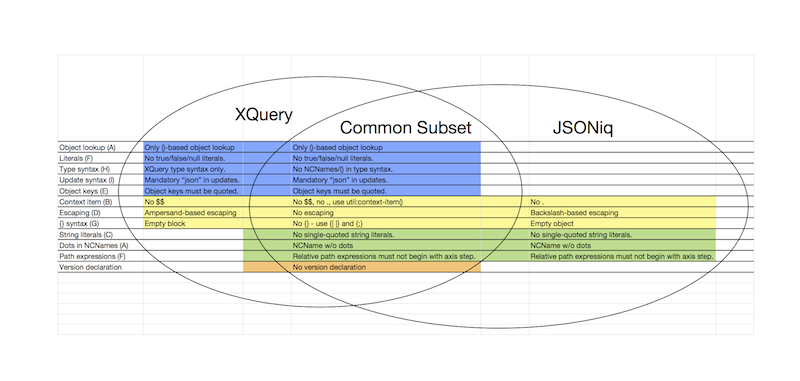

# XQuery & JSONiq (XML & JSON)

## One VM, two syntaxes

In Zorba 2.6, we introduced JSON support with the new [JSONiq](http://jsoniq.org) language.
JSONiq extends XQuery with JSON support while leaving its XML functionality (almost) intact.
This came at the cost of either circumvoluted syntax for JSON (like empty objects, or object lookup), or for breaking some XML corner-case functionality (like true, false and null that are recognized as literals rather than as XPath name tests).

We have received a lot of feedback since then, and realized that, for those of you who would like to work primarily with JSON, it made sense to let the JSONiq syntax live its own life.

Concretely, this means that:
1. The "virtual machine" (abstract query language, compiler and runtime) stays the same
and fully support both XML and JSON.
2. But Zorba supports two syntaxes for it: XQuery and <a href="http://www.jsoniq.org/">JSONiq</a>, which are each tailored to
the aesthetics preferences of each community.

## What they share

XQuery and JSONiq share:
* The same type system: values are sequences of items, which can be XML nodes, JSON objects
or arrays, atomic items or functions.
* The same operations on atomic types.
* The same semantics of core expressions such that if-then-else expressions, FLWOR expressions.
* The same abstract navigation mechanism for both XML (XPath) and JSON (object and array lookup).

## Two faces of the same language
To put it boldly, in terms of syntax, XQuery and JSONiq can be seen as two faces of the same
language.

The XQuery syntax provides first-class XML support (full W3C conformance), as well as
second-class JSON support ("JSONiq extension to XQuery" : everything JSONiq that does not
collide with XQuery).

The JSONiq syntax provides first-class JSON support (nice JavaScript-like dot-based object lookup,
full JSON copy-and-paste support, etc) and second-class XML support ("XQuery extension to JSONiq" :
everything XQuery that does not collide with JSONiq).

## Syntactic contentious points

Here is a more detailed description of the collisions between XML and JSON support.

A. **Dots in NCNames vs. Dot-based object lookup.**
XML names can contain dots, but dots are also used for object lookup. In particular,
$var.key can be interpreted as a variable named "var.key" or as a lookup in the object
$var for the key "key".

B. **Context item syntax.**
XQuery uses dots for the context item syntax. But combined with object lookup, it becomes
hard to read: ..key for looking up the key "key" in the context item.

C. **String literals.**
XQuery supports both single-quoted and double-quoted literals. JSON only supports double-quoted
literals. 

D. **Character escaping.**
XML uses apersand-based escaping, like &#a; or &amp;.
JSON uses backslash-based escaping, like \u0010 or \\.

E. **Object keys.**
In some JSON languages, simple object keys (containing no spaces, etc) may be unquoted. This collides
with XPath name tests.

F. **true, false and null literals vs. XPath name tests.**
In XQuery, booleans can be constructed with the functions true() and false(), because true and false
would be recognized as name tests. In JSON data, true and false appear as literals.

G. **Empty object vs. empty block syntax.**
In JSON, the empty object is denoted {}.
In Zorba's scripting extension to XQuery, {} is used for the empty block.

H. **Type syntax.**
XQuery supports user-defined atomic types. To avoid collisions, XML node types use parentheses: node(),
element(), etc as well as namespaces: xs:integer, xs:string, etc.
<a href="http://www.jsoniq.org/">JSONiq</a> aims at a simpler syntax, with no parentheses: integer, string, object, array.

I. **Update syntax.**
The XQuery update syntax collides with the JSON update syntax (insert, delete, replace, rename).

## The XQuery Syntax

This syntax is fully conformant and backwards compatible with [XQuery 3.0](http://www.w3.org/TR/xquery-30/).

It is a superset of XQuery.
It is not a superset of JSON.

A. No dot-based object lookup - use $object("key") instead.

B. No $$ for the context item - use . instead.

D. XML, ampersand-based escaping in string literals (you can switch with an option).

E. Object keys must be quoted.

F. No true/false/null literals - use fn:true(), fn:false() and jn:null() instead.

G. {} is the empty block. Use {| |} for the empty object.

H. XQuery-style type syntax: (a) builtin atomic types must be prefixed with xs:,
                            (b) Non-atomic types must be followed by parentheses : object()...
                            (c) The empty-sequence() type must be written as such.

I. "json" is mandatory in the JSON update syntax.

\section jsoniq_syntax The JSONiq syntax

This syntax fully supports <a href="http://www.jsoniq.org/">JSONiq</a>, as well as some aspects of the XQuery syntax.

It is a superset of JSON (yes, you can copy-and-paste JSON data in a <a href="http://www.jsoniq.org/">JSONiq</a> query).
It is not a superset of XQuery.

A. No names containing dots.

B. No . for the context item - use $$ instead.

C. No single-quoted literals. Use double-quoted literals instead.

D. JSON, baskslash-based escaping in string literals (you can switch with an option).

F. No axis step allowed at the beginning of a relative path expression. Instead of using
foo:bar, you must use $$/foo:bar.

G. {} is for empty objects. Use {;} for empty blocks.

## How to specify which syntax your query is using

In order to pick a parser, you can add a version declaration on top of your module:

``xquery
xquery version "3.0";
``

will pick the XQuery parser.

``xquery
jsoniq version "1.0";
``

will pick the JSONiq parser.

In the absence of any version declaration, the XQuery parser is taken by default.

## Interlanguage Module Imports

It is possible for a module written in XQuery syntax (xquery version declaration or no version
declaration), to import another module written in <a href="http://www.jsoniq.org/">JSONiq</a> syntax (jsoniq version declaration), and
vice-versa.

## JSONiq queries can still be parsed with the XQuery parser. 

If you wrote JSONiq queries with a preceding version of Zorba, they should work with the
XQuery parser. Since it is the default, you do not need to add any version declaration.
In order to restore full W3C conformance though, true/false/null literals are deprecated
in the XQuery parser. While they will still work in Zorba 2.9, a warning will be issued.
They will be obsolete in Zorba 3.0 and considered XPath name tests again. Of course,
the JSONiq syntax still fully supports these literals.